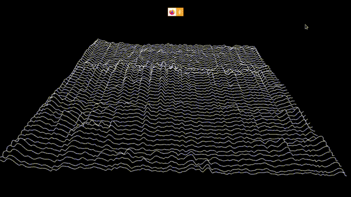

# Waterfall plot in Javascript 3D - Raw WebGL version

A moving [Waterfall Plot](https://en.wikipedia.org/wiki/Waterfall_plot) using raw WebGL and web audio.

Live Demo: <https://jo-m.ch/repos/waterfall-plot-webgl/>

Controls:

- `zxcvb` for some color presets
- `q` to toggle lines
- `wertyu` changes the line color
- `a` to toggle solid coloring
- `sdfghj` to change solid color

There also is a ThreeJS version: <https://github.com/jo-m/waterfall-plot>.
